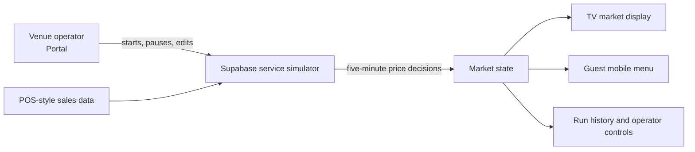

# Night Economy

> A live drinks-pricing prototype for venues: one operator portal, one market engine, and guest-facing TV and mobile displays that stay in sync.

Night Economy lets a venue run a live drinks market: operators manage the catalogue and service, while guests see current prices on a TV display and mobile menu.

**[Try the public demo](https://night-economy.pages.dev/public-demo)** · **[Read the case study](docs/portfolio-case-study.md)** · **[View deployment guide](docs/deployment.md)**

## Why this exists

Venue teams need a simple way to make a drinks offer feel active without losing control of pricing. Night Economy turns that idea into a working product flow: start a service, gather POS-style demand, publish controlled price rounds, and present the same market to staff, a venue screen, and guests' phones.

## See it in action

Open the [public demo](https://night-economy.pages.dev/public-demo) on a laptop—no sign-in required. It is a read-only live venue: its real-time market runs continuously, prices change every five minutes, and the TV presentation changes every 15 seconds. Open the Market and Mobile Market from the demo to see the guest-facing views update from the same service.

Public visitors cannot edit drinks, settings, POS links, or service controls. Private operator access remains separate.

## Product journey



## What I built

- An operator portal for schedules, drinks, POS mapping, service controls, run history, and venue settings.
- A live TV market display with a 15-second presentation rhythm, market stories, price movement, and full-screen use.
- A guest mobile menu that reads the same live market state as the TV.
- A POS-style Friday service simulator and a cloud-side simulator for repeatable rehearsals.
- A pricing engine that publishes controlled five-minute price rounds, with shared logic guarded against cloud/local drift.
- Supabase Auth, Row Level Security, scheduled Edge Functions, migrations, and Cloudflare Pages deployment.

## Evidence of engineering quality

- 126 unit/integration tests plus 14 browser workflows cover product and service behaviour.
- The release suite verifies source reachability, environment safety, Supabase SQL/function safeguards, pricing-engine parity, routing, and a production preview.
- The public production site is deployed on [Cloudflare Pages](https://night-economy.pages.dev/).

New to this codebase? Begin with [START-HERE.md](START-HERE.md) for a plain-English map of the project.

The browser application has one React/Vite/TypeScript entrypoint at `index.html`. Supabase owns persistent state and service automation; Cloudflare Pages serves only the compiled frontend.

## Stack

- React + Vite + TypeScript
- Cloudflare Pages for frontend hosting
- Supabase Postgres/Auth for backend, data, and login
- Supabase Edge Functions for market jobs
- Vitest for pricing engine tests

See [docs/deployment.md](docs/deployment.md) for the ordered Supabase and Cloudflare deployment checklist.
See [docs/pos-integration-contract.md](docs/pos-integration-contract.md) for the boundary between a POS and Night Economy.
See [docs/pricing-engine-rules.md](docs/pricing-engine-rules.md) for the market-points model and operator safeguards.
See [docs/simulation-engine.md](docs/simulation-engine.md) for the customer, basket, trend, and price-response model used in rehearsals.
See [docs/friday-service-acceptance.md](docs/friday-service-acceptance.md) for the accelerated local POS acceptance run.
See [docs/testing.md](docs/testing.md) for the required Chromium button-testing contract and test commands.
See [docs/README.md](docs/README.md) for the complete documentation index and visual references.

## Community and security

- [Contributing guide](CONTRIBUTING.md)
- [Code of conduct](CODE_OF_CONDUCT.md)
- [Security policy](SECURITY.md)
- [MIT licence](LICENSE)

## Repository Map

- `src/` — the Cloudflare Pages React app, grouped into API access, reusable components, market logic, and route-level pages.
- `pos-simulator/` — the standalone Friday-service POS simulator and its local browser UI.
- `supabase/functions/` — deployed scheduler, simulator, and pricing Edge Functions; shared scheduler logic lives in `_shared/`.
- `supabase/migrations/` — immutable database history in application order. Do not squash migrations already applied to a project.
- `scripts/` — local verification, setup, and operational commands exposed through `package.json`.
- `tests/unit/` and `tests/integration/` — deterministic logic and service-contract coverage.
- `tests/e2e/` — Chromium user workflows for the site, portal, market surfaces, and local POS simulator.

## Runtime Flow

1. The portal stores venue settings and requests simulator actions through Supabase.
2. `service-scheduler` evaluates every venue schedule once per minute.
3. `venue-simulator` uses the configured takings target to size expected footfall, then creates seeded customer groups and price-sensitive baskets; realised takings remain an outcome.
4. `market-cycle` applies the shared zero-sum pricing engine every five simulated minutes.
5. TV, menu, simulator, and run-history pages read the same Supabase records.

The canonical pricing implementation is `supabase/functions/_shared/marketPricing.ts`; the canonical rehearsal-demand implementation is `supabase/functions/_shared/customerDemand.ts`. Cloud and local simulations use the same demand model. The local POS connector retains a small JavaScript pricing adapter, and `npm run pricing:sync` prevents that adapter from drifting.

## Run Locally

```bash
npm install
npm run dev
```

Run the local POS Simulator in a second terminal:

```bash
npm run simulator:dev
```

It provides the Friday-night service GUI and POS API at `http://127.0.0.1:3002`.

With real Supabase credentials, the simulator automatically starts its local connector. It polls every 3.75 seconds, imports sales, asks the protected Supabase `market-cycle` function to calculate each five-minute market round, then publishes the resulting prices back to the local POS.

`npm run simulator:market` remains available only when you need to run that connector separately. Use Node.js 22 or newer. `.nvmrc` is set to `22` for local shells that use `nvm`.

Open the app:

```text
http://127.0.0.1:5173/
http://127.0.0.1:5173/?view=tv
http://127.0.0.1:5173/?view=mobile
http://127.0.0.1:5173/?view=site
http://127.0.0.1:5173/?view=portal
http://127.0.0.1:5173/tv/demo-venue
http://127.0.0.1:5173/menu/demo-venue
http://127.0.0.1:5173/app/demo-venue
```

`?view=` routes are local shortcuts. Production-shaped venue routes use `/venue/:slug`, `/tv/:slug`, `/menu/:slug`, and `/app/:slug`.

## Environment

Create `.env.local` from `.env.example`:

```text
VITE_SUPABASE_URL=https://ghhfmsmmwyycuwauvppg.supabase.co
VITE_SUPABASE_PUBLISHABLE_KEY=...
```

Only use these in local setup scripts or Supabase Edge Function secrets:

```text
SUPABASE_SERVICE_ROLE_KEY=...
SCHEDULER_SECRET=...
```

Never expose `SUPABASE_SERVICE_ROLE_KEY` in the browser or Cloudflare Pages frontend variables.
`npm run check:env` rejects service-role JWTs and Supabase secret keys in any `VITE_` browser variable.

## Cloudflare Pages

Cloudflare Pages config lives in `wrangler.jsonc`:

```text
name: night-economy
pages_build_output_dir: ./dist
```

Build command:

```bash
npm run build:production
```

Build output directory:

```text
dist
```

Frontend variables:

```text
VITE_SUPABASE_URL
VITE_SUPABASE_PUBLISHABLE_KEY
```

Local builds can use `npm run build`. Production deploys should use `npm run build:production` so missing Supabase config fails before Cloudflare publishes the site.

`public/_redirects` sends all app routes to `index.html`, the React entrypoint.

Local `npm run check` verifies the Cloudflare config with `npm run cloudflare:config`.

To publish the already-built frontend to production from this repository:

```bash
npx wrangler pages deploy dist --project-name night-economy --branch main --commit-dirty=true
```

Run `npm run build:production` first. This publishes only the compiled frontend; Supabase migrations and Edge Functions follow the separate steps in [docs/deployment.md](docs/deployment.md).

## Pre-Deploy Check

Run this before pushing a deploy branch:

```bash
npm run smoke:preview
```

It builds the app, starts Vite's production preview server, and checks the React root, local view shortcuts, and production venue routes.
It also validates the Cloudflare Pages redirect rule so production venue routes hit the React app.
