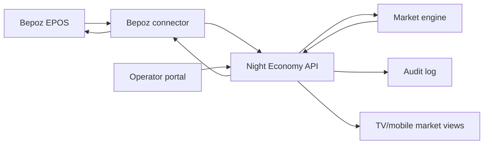

# Bepoz EPOS Integration Outline and Platform Schema

Last researched: 2026-06-14

## Executive Position

Night Economy should integrate with Bepoz through a vendor-supported integration route, not by guessing private Bepoz database tables or writing directly to a venue POS database.

The public Bepoz websites confirm that Bepoz is a hospitality POS platform with back-office, inventory, reporting, stock/menu updates, and a large integration ecosystem. They do not publish public API documentation, authentication details, webhook formats, table schemas, or price-write endpoints. Because of that, this document defines our side of the integration exactly, and defines the Bepoz side as a contract that must be confirmed through Bepoz partner access, Bepoz support, or venue-provided integration documentation.

The correct build path is:

1. Connect to Bepoz as an approved integration partner or approved venue integration.
2. Pull the Bepoz product/menu catalogue into Night Economy.
3. Map Bepoz products to Night Economy market instruments.
4. Ingest sales and availability signals from Bepoz.
5. Calculate Night Economy market prices.
6. Publish approved price/status changes back to Bepoz only through a supported Bepoz write mechanism.
7. Keep every change auditable, reversible, and idempotent.

## Confirmed From Public Sources

These are the facts this plan can rely on from public Bepoz material:

| Fact | Source |
| --- | --- |
| Bepoz describes itself as an all-in-one platform for payments, customer engagement, and point of sale. | https://bepoz.com.au/ |
| Bepoz advertises real-time stock and menu updates in its self-ordering/digital-menu materials. | https://bepoz.com.au/ |
| Bepoz advertises 220+ integrations and has a "Become an Integration Partner" route. | https://bepoz.com.au/partners/integrations and https://bepoz.com.au/partners/form |
| Bepoz POS has back-office software covering cash, customer, staff, sales, inventory, purchasing, promotions, and member information. | https://bepoz.com.au/solutions/pos |
| Bepoz says its POS can integrate with third-party systems for areas including marketing, stock control, payments, property management, reservations, scales, and scanning. | https://bepoz.com.au/solutions/pos |
| Bepoz UK describes real-time visibility, stock management, reporting, customised audits, and price change alerts. | https://bepoz.co.uk/ |
| Bepoz America describes multi-location management including scheduling menus and product pricing. | https://bepoz.com/ |

## Not Publicly Confirmed

The following details were not found in public Bepoz documentation and must be obtained from Bepoz or the venue's Bepoz installer/support contact:

| Unknown | Why It Matters |
| --- | --- |
| Whether Bepoz exposes a public REST, SOAP, GraphQL, file, ODBC, database, or local-agent integration method. | Determines connector implementation. |
| Authentication method, token lifetime, and per-venue credential model. | Required for secure onboarding. |
| Product/menu endpoint names and exact field names. | Required for catalogue sync. |
| Sales/order event delivery method: webhook, polling API, export file, database view, or report. | Required for live price movement. |
| Whether third parties can update POS product prices programmatically. | Required before Night Economy can publish dynamic prices into Bepoz. |
| Whether price updates can be scheduled, immediate, scoped by terminal, scoped by menu, or scoped by venue. | Required for safe live operation. |
| Whether Bepoz supports sandbox/test venues. | Required for implementation and QA. |
| Rate limits, retry rules, and support expectations. | Required for reliability. |

## Integration Architecture



The Bepoz connector is a boundary service. It isolates Bepoz-specific authentication, field mapping, retries, and vendor constraints from the Night Economy market engine.

## Data Direction

| Data | Direction | Required For | Notes |
| --- | --- | --- | --- |
| Venue identity | Bepoz to Night Economy, or manual setup | Connection setup | Bepoz venue/location identifiers must be stored as external IDs. |
| Product/menu catalogue | Bepoz to Night Economy | Adding drinks, mapping products | Pull from Bepoz where possible. Manual creation remains a fallback. |
| Product availability/stock state | Bepoz to Night Economy | Pausing unavailable drinks | If stock events are unavailable, use manual operator controls. |
| Sales/order line events | Bepoz to Night Economy | Market price movement | Best source is item-level sales events with timestamps, quantities, and prices. |
| Night Economy market price | Night Economy to Bepoz | Dynamic prices at POS | Only if Bepoz provides an approved write method. |
| Night Economy live/paused state | Night Economy to Bepoz or display-only | Temporarily hiding market instruments | If write access is not supported, keep the POS unchanged and only update TV/mobile displays. |
| Audit and reconciliation | Night Economy internal, optionally exported | Operations and support | Every price publish needs traceability. |

## Minimum Bepoz Contract Needed

Before writing connector code, request this from Bepoz:

1. Integration partner/API documentation.
2. Sandbox or test venue access.
3. Authentication method and credential rotation process.
4. Product/menu read method with sample payload.
5. Sales/order event method with sample payload.
6. Stock/availability read method with sample payload.
7. Price/status write method with sample request and response.
8. Error codes, retry policy, rate limits, and support escalation route.
9. Confirmation that dynamic price updates are supported for live venue trading.
10. Confirmation of whether Bepoz requires operator approval before third-party price changes go live.

## Night Economy API Endpoints

These are our platform-side endpoints. They do not depend on Bepoz publishing public endpoint names.

### Connection Setup

`POST /api/integrations/bepoz/connections`

Creates a Bepoz connection for a Night Economy venue.

```json
{
  "venueId": "ven_123",
  "environment": "production",
  "bepozSiteId": "external-site-id-from-bepoz",
  "displayName": "Bepoz main bar",
  "credentialsRef": "secret-manager-reference"
}
```

`PATCH /api/integrations/bepoz/connections/{connectionId}`

Updates connection status, credential reference, or sync settings.

`POST /api/integrations/bepoz/connections/{connectionId}/test`

Runs a safe connectivity/authentication check.

### Catalogue Sync

`POST /api/integrations/bepoz/connections/{connectionId}/sync/products`

Starts a catalogue sync from Bepoz into Night Economy.

`GET /api/venues/{venueId}/market/products`

Returns products available for the market board and operator portal.

`POST /api/venues/{venueId}/market/products`

Adds a manual Night Economy market product when it does not yet exist in Bepoz or is being tested before POS mapping.

`PATCH /api/venues/{venueId}/market/products/{marketProductId}`

Updates market-facing product fields: label, category, live status, hidden status, current price, base price, floor price, and ceiling price.

### Events

`POST /api/integrations/bepoz/connections/{connectionId}/events/sales`

Receives normalized Bepoz sales events if Bepoz supports push/webhook delivery. If Bepoz only supports polling/export, the connector should call this endpoint after normalizing the payload.

`POST /api/integrations/bepoz/connections/{connectionId}/events/stock`

Receives stock or availability events where supported.

`POST /api/venues/{venueId}/market/reprice`

Triggers a market recalculation from recent sales, availability, rules, and operator overrides.

### Price Publishing

`POST /api/venues/{venueId}/price-publications`

Creates a price publication job for Bepoz. This should support approval, dry-run, publish, and rollback modes.

```json
{
  "mode": "dry_run",
  "connectionId": "pos_conn_123",
  "reason": "market_tick",
  "prices": [
    {
      "marketProductId": "mp_espresso_martini",
      "externalProductId": "bepoz-product-id",
      "newPriceMinor": 950,
      "currency": "GBP"
    }
  ]
}
```

`GET /api/venues/{venueId}/price-publications/{jobId}`

Returns publication status, Bepoz responses, failures, and reconciliation result.

`POST /api/venues/{venueId}/price-publications/{jobId}/rollback`

Restores the last known good Bepoz prices where the Bepoz write mechanism supports it.

## Database Schema

The schema below is platform-owned. Bepoz-specific raw payloads should be stored for audit/debugging, but Night Economy should operate on normalized fields.

```sql
create table venues (
  id text primary key,
  name text not null,
  timezone text not null default 'Europe/London',
  currency text not null default 'GBP',
  created_at timestamptz not null default now(),
  updated_at timestamptz not null default now()
);

create table pos_connections (
  id text primary key,
  venue_id text not null references venues(id),
  provider text not null check (provider = 'bepoz'),
  environment text not null check (environment in ('sandbox', 'production')),
  external_site_id text,
  display_name text not null,
  credentials_ref text not null,
  status text not null check (status in ('draft', 'connected', 'paused', 'error')),
  last_connected_at timestamptz,
  created_at timestamptz not null default now(),
  updated_at timestamptz not null default now()
);

create table pos_external_products (
  id text primary key,
  venue_id text not null references venues(id),
  pos_connection_id text not null references pos_connections(id),
  external_product_id text not null,
  external_plu text,
  external_sku text,
  external_category_id text,
  external_category_name text,
  name text not null,
  price_minor integer,
  currency text not null default 'GBP',
  is_available boolean,
  raw_payload jsonb not null,
  first_seen_at timestamptz not null default now(),
  last_seen_at timestamptz not null default now(),
  unique (pos_connection_id, external_product_id)
);

create table market_products (
  id text primary key,
  venue_id text not null references venues(id),
  pos_external_product_id text references pos_external_products(id),
  market_symbol text not null,
  display_name text not null,
  category text not null,
  base_price_minor integer not null,
  current_price_minor integer not null,
  floor_price_minor integer not null,
  ceiling_price_minor integer not null,
  is_live boolean not null default false,
  is_hidden boolean not null default false,
  operator_note text,
  created_at timestamptz not null default now(),
  updated_at timestamptz not null default now(),
  unique (venue_id, market_symbol)
);

create table market_price_rules (
  id text primary key,
  venue_id text not null references venues(id),
  market_product_id text references market_products(id),
  rule_type text not null,
  config jsonb not null,
  is_enabled boolean not null default true,
  created_at timestamptz not null default now(),
  updated_at timestamptz not null default now()
);

create table pos_sales_events (
  id text primary key,
  venue_id text not null references venues(id),
  pos_connection_id text not null references pos_connections(id),
  external_event_id text,
  external_product_id text,
  pos_external_product_id text references pos_external_products(id),
  occurred_at timestamptz not null,
  quantity numeric(12, 3) not null,
  gross_amount_minor integer,
  net_amount_minor integer,
  currency text not null default 'GBP',
  raw_payload jsonb not null,
  received_at timestamptz not null default now(),
  unique (pos_connection_id, external_event_id)
);

create table pos_stock_events (
  id text primary key,
  venue_id text not null references venues(id),
  pos_connection_id text not null references pos_connections(id),
  external_event_id text,
  external_product_id text,
  pos_external_product_id text references pos_external_products(id),
  occurred_at timestamptz not null,
  state text not null check (state in ('available', 'low_stock', 'out_of_stock', 'unknown')),
  quantity_remaining numeric(12, 3),
  raw_payload jsonb not null,
  received_at timestamptz not null default now()
);

create table market_price_snapshots (
  id text primary key,
  venue_id text not null references venues(id),
  market_product_id text not null references market_products(id),
  price_minor integer not null,
  floor_price_minor integer not null,
  ceiling_price_minor integer not null,
  demand_score numeric(10, 4),
  reason text not null,
  calculated_at timestamptz not null default now()
);

create table price_publication_jobs (
  id text primary key,
  venue_id text not null references venues(id),
  pos_connection_id text not null references pos_connections(id),
  mode text not null check (mode in ('dry_run', 'publish', 'rollback')),
  status text not null check (status in ('queued', 'running', 'succeeded', 'partial', 'failed', 'cancelled')),
  requested_by text,
  request_payload jsonb not null,
  response_payload jsonb,
  started_at timestamptz,
  finished_at timestamptz,
  created_at timestamptz not null default now()
);

create table integration_sync_runs (
  id text primary key,
  venue_id text not null references venues(id),
  pos_connection_id text not null references pos_connections(id),
  sync_type text not null check (sync_type in ('products', 'sales', 'stock', 'prices', 'healthcheck')),
  status text not null check (status in ('running', 'succeeded', 'partial', 'failed')),
  records_seen integer not null default 0,
  records_changed integer not null default 0,
  error_message text,
  started_at timestamptz not null default now(),
  finished_at timestamptz
);

create table audit_log (
  id text primary key,
  venue_id text not null references venues(id),
  actor_type text not null check (actor_type in ('operator', 'system', 'integration')),
  actor_id text,
  action text not null,
  entity_type text not null,
  entity_id text not null,
  before_payload jsonb,
  after_payload jsonb,
  created_at timestamptz not null default now()
);
```

## Product Mapping

| Night Economy Field | Bepoz Source | Certainty |
| --- | --- | --- |
| `pos_external_products.external_product_id` | Bepoz product/item identifier | Requires Bepoz docs/sample payload. |
| `pos_external_products.external_plu` | Bepoz PLU or equivalent | Likely POS concept, but exact field name requires confirmation. |
| `pos_external_products.external_sku` | Bepoz SKU or equivalent | Requires confirmation. |
| `pos_external_products.name` | Bepoz product/menu item name | Requires sample payload. |
| `pos_external_products.price_minor` | Current Bepoz price | Requires read access. |
| `market_products.base_price_minor` | Initial Bepoz price or operator-defined base | Platform-owned after import. |
| `market_products.floor_price_minor` | Operator-defined | Platform-owned. |
| `market_products.ceiling_price_minor` | Operator-defined | Platform-owned. |
| `market_products.current_price_minor` | Night Economy market engine | Platform-owned. |
| `market_products.is_live` | Operator setting, optionally reflected in Bepoz | Platform-owned; Bepoz write support unknown. |

## Price Publishing Rules

1. Never write prices to Bepoz without a successful dry run.
2. Never write outside floor/ceiling rules.
3. Never write a price without storing an audit log entry.
4. Never assume a write succeeded until Bepoz confirms it or a reconciliation read confirms the expected value.
5. Every publication request must be idempotent. Retrying the same job must not double-apply changes.
6. If Bepoz write support is unavailable, Night Economy must run display-only: TV/mobile market prices update, while POS prices remain controlled in Bepoz.
7. If Bepoz supports scheduled price changes, prefer scheduled batches over rapid individual updates during busy service.
8. If Bepoz supports only manual import/export, price publication should create an operator-approved export file rather than direct POS changes.

## Reconciliation

Run reconciliation after every publish and at least daily:

1. Pull Bepoz product prices.
2. Compare Bepoz price to the latest successful `price_publication_jobs` payload.
3. Flag mismatches in the portal.
4. Do not auto-correct repeatedly without operator approval.
5. Record all discrepancies in `integration_sync_runs` and `audit_log`.

## MVP Phases

### Phase 1: Display-Only Integration

Use this phase if Bepoz write access is not confirmed.

- Import or manually map drinks.
- Ingest sales if available; otherwise simulate/demo sales inside Night Economy.
- Display dynamic prices on TV/mobile.
- Operators manually change Bepoz prices if they want POS alignment.

### Phase 2: Read Integration

Use this phase once Bepoz confirms product and sales read access.

- Sync products from Bepoz.
- Store Bepoz external IDs.
- Ingest item-level sales events or sales exports.
- Drive the market algorithm from real sales.
- Keep price publication disabled until write access is confirmed.

### Phase 3: Controlled Write Integration

Use this phase only after Bepoz confirms safe price/status writes.

- Enable dry-run price publication.
- Enable operator-approved publishing.
- Add rollback jobs.
- Reconcile after each publish.
- Add venue-level rate limits and service-hour rules.

### Phase 4: Live Automation

Use this phase only after repeated successful reconciliation in a real venue.

- Publish scheduled price batches.
- Allow rules-based automatic price movements.
- Keep manual pause, floor, ceiling, and rollback controls one click away.

## Implementation Checklist

- [ ] Get Bepoz partner/API documentation.
- [ ] Get a sandbox or test venue.
- [ ] Confirm whether price writes are supported.
- [ ] Confirm whether sales events are push, poll, export, or report-based.
- [ ] Confirm product identity fields and sample payloads.
- [ ] Build `pos_connections` onboarding.
- [ ] Build product sync into `pos_external_products`.
- [ ] Build product mapping into `market_products`.
- [ ] Build sales event ingestion.
- [ ] Build market repricing.
- [ ] Build dry-run price publication.
- [ ] Build publish and rollback only after Bepoz confirms the write contract.
- [ ] Build reconciliation and audit views in the portal.

## Final Certainty Statement

It is factually safe to say Bepoz has POS, back-office, inventory, reporting, menu/stock update capabilities, and an integration partner ecosystem. It is not factually safe, from public sources alone, to claim a specific Bepoz API endpoint, database schema, webhook payload, or price-write method.

Therefore, the exact implementation should be a Bepoz connector around a confirmed vendor contract, with Night Economy owning the normalized endpoints and schema defined above.
