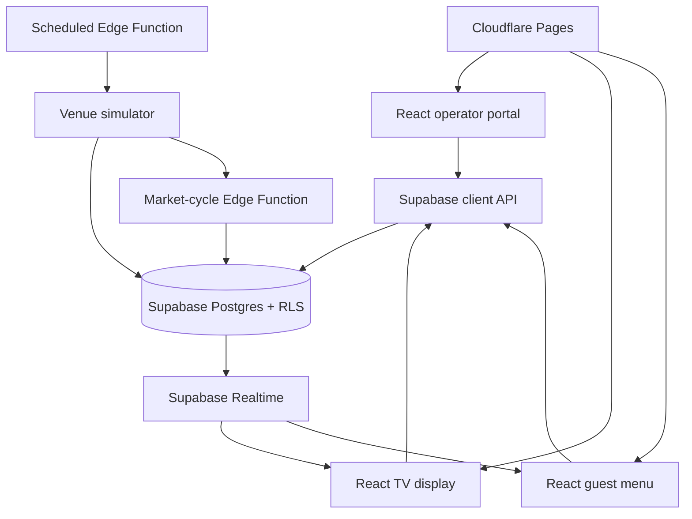

# Night Economy: a live drinks-pricing prototype

## The challenge

Drinks pricing in a venue is usually static. That makes it difficult to create urgency around slow-moving stock, respond to demand during service, or give guests a reason to look at the menu again. The challenge was to make dynamic pricing understandable and usable for a busy venue team—not just technically possible.

## The product

Night Economy is a working prototype with three connected experiences:

| Audience | Experience | Job to be done |
| --- | --- | --- |
| Venue operator | Portal | Configure drinks, start or control a service, review price rounds and outcomes. |
| Guests in venue | TV market | See current prices and a visual market story at a distance. |
| Guests on phone | Mobile market | Browse the same live drink prices without needing an app. |

The operator starts an 18-minute rehearsal or a real-time service. A simulator produces POS-style demand; the market engine produces a new controlled price decision every five simulated minutes; and the TV and mobile experiences read that shared state.

## Key decisions

### Keep the operator in control

The portal makes the live/archived state, POS mapping, price boundaries, priority drinks, schedules, and service controls visible in one place. It uses simple language because the person operating a venue does not need to think in database terms.

### Treat the display as a paced experience

Prices update every five minutes, but the TV changes its presentation every 15 seconds. This gives the screen a sense of movement without pretending prices are changing more often than they are.

### Make rehearsals realistic enough to learn from

The project includes both a local Friday-night POS simulator and a cloud-side service simulator. This allows demand, customer baskets, price response, stock state, and price rounds to be exercised before connecting a real POS.

### Build security and operations in early

The product uses Supabase Auth and Row Level Security for venue-scoped data, immutable SQL migrations for changes, scheduled Edge Functions for service automation, and Cloudflare Pages for the frontend. The repository includes automated checks for source reachability, SQL safety, public routes, pricing-engine parity, and browser workflows.

## Technical architecture

## What I would validate next

This is a working product prototype, not a claim that dynamic pricing is ready for every venue. The next validation steps would be:

1. Watch a real venue manager use the portal without guidance.
2. Test whether guests understand why a price changes and whether the display increases attention or sales.
3. Connect one real POS integration in a controlled pilot.
4. Agree pricing guardrails, venue messaging, and success measures before any commercial rollout.

## Live demo

Use a laptop for the best experience.

Start at the [public demo](https://night-economy.pages.dev/public-demo). No sign-in is required. The market stays live continuously, while the Portal is deliberately view-only; open Market and Mobile Market from there to see the connected guest-facing experiences.
